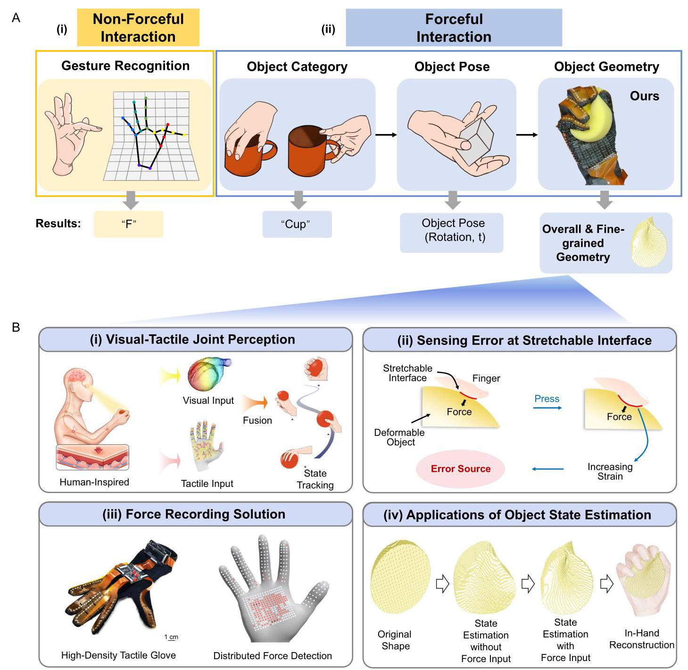
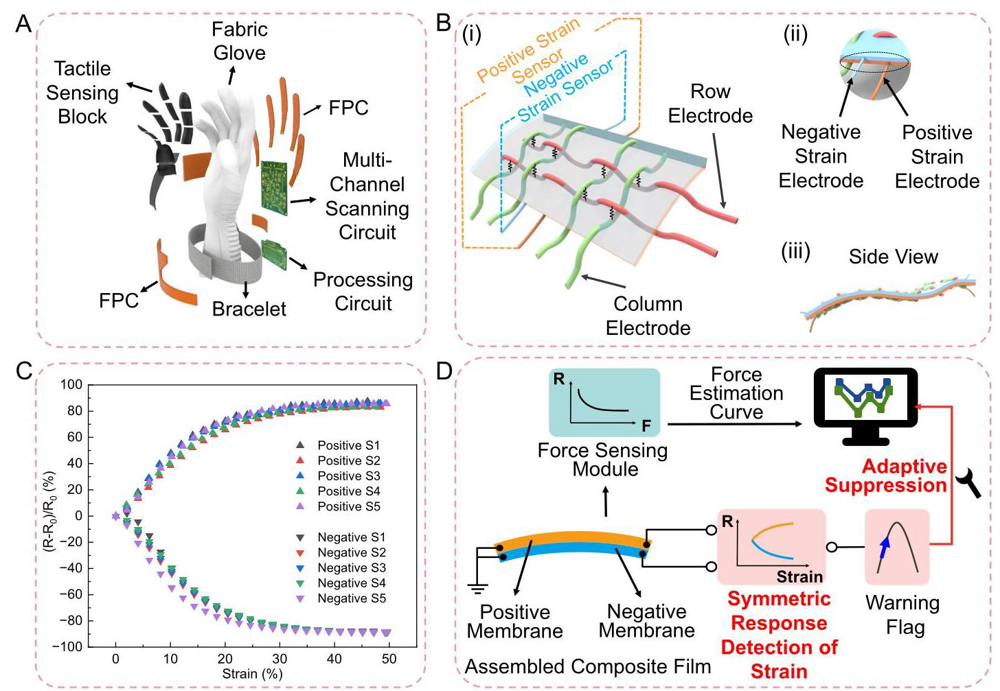
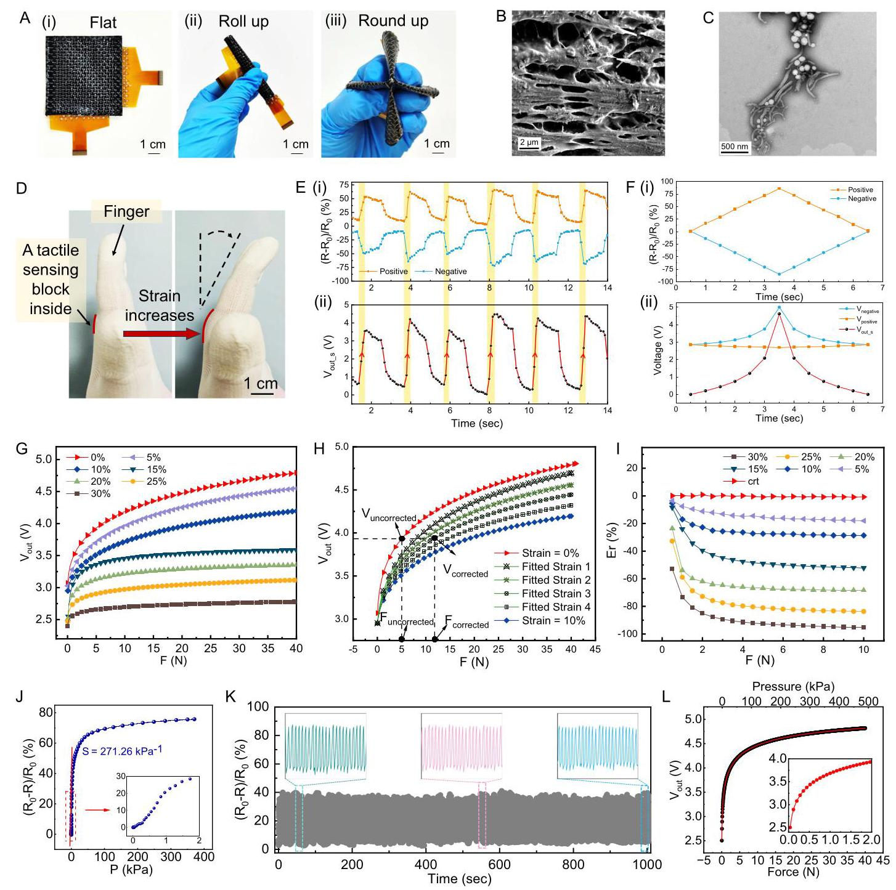
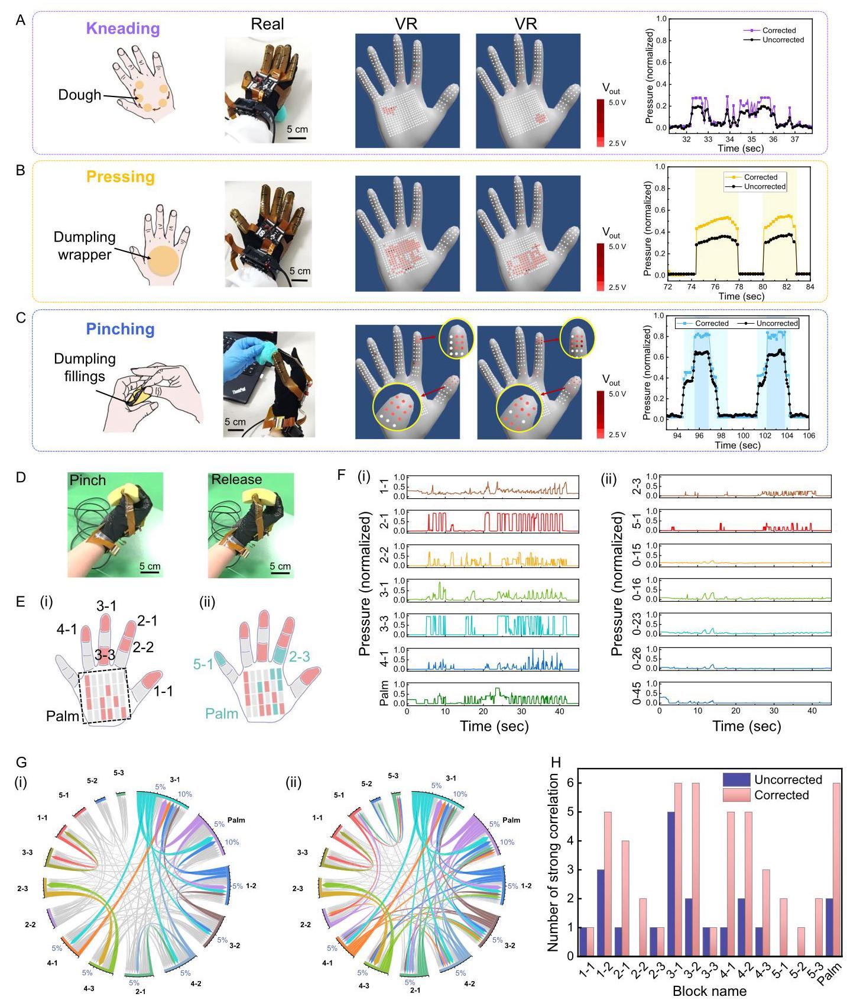
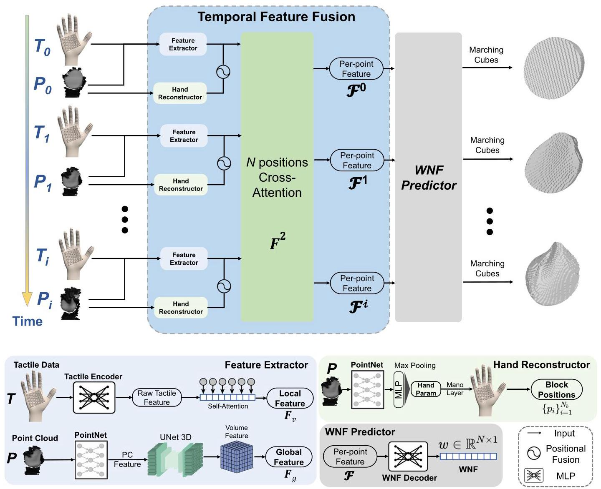
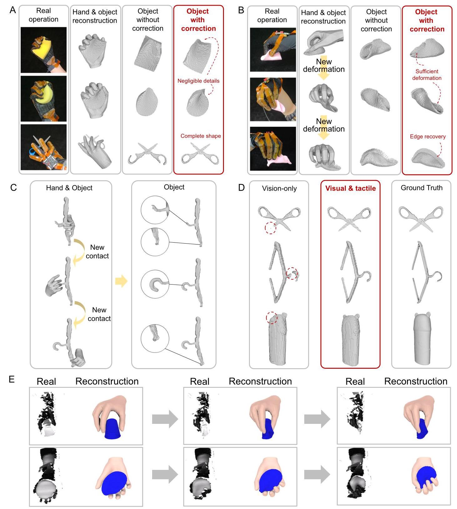

# Capturing forceful interaction with deformable objects using a deep learning- powered stretchable tactile array

Chunpeng Jiang 6 ${}^{1,7}$ , Wenqiang Xu ${}^{2,7}$ , Yutong Li ${}^{2}$ , Zhenjun Yu @ ${}^{2}$ , Longchun Wang ${}^{1}$ , Xiaotong Hu ${}^{1,3}$ , Zhengyi Xie ${}^{1,3}$ , Qingkun Liu ${}^{1}$ Bin Yang ${}^{1}$ , Xiaolin Wang ${}^{1}$ , Wenxin Du ${}^{2}$ , Tutian Tang © ${}^{2}$ , Dongzhe Zheng ${}^{2}$ , Siqiong Yao ${}^{2}$ , Cewu Lu ${}^{5,6}$ & Jingquan Liu ${}^{1}$ )

Capturing forceful interaction with deformable objects during manipulation benefits applications like virtual reality, telemedicine, and robotics. Replicating full hand-object states with complete geometry is challenging because of the occluded object deformations. Here, we report a visual-tactile recording and tracking system for manipulation featuring a stretchable tactile glove with 1152 force-sensing channels and a visual-tactile joint learning framework to estimate dynamic hand-object states during manipulation. To overcome the strain interference caused by contact with deformable objects, an active suppression method based on symmetric response detection and adaptive calibration is proposed and achieves 97.6% accuracy in force measurement, contributing to an improvement of 45.3%. The learning framework processes the visual-tactile sequence and reconstructs hand-object states. We experiment on 24 objects from 6 categories including both deformable and rigid ones with an average reconstruction error of ${1.8}\mathrm{\;{cm}}$ for all sequences, demonstrating a universal ability to replicate human knowledge in manipulating objects with varying degrees of deformability.

---

Received: 20 February 2024

Accepted: 18 October 2024

Published online: 04 November 2024

B. Check for updates

---

Human-machine interaction (HMI) systems serve as gateways to the metaverse, acting as bridges between the physical world and the digital realm. A natural user interface in HMI allows humans to perform natural and intuitive control ${}^{1}$ . Although the non-forceful interfaces such as hand gestures (Fig. 1A(i)) can be tracked using technologies like inertial measurement units ${\left( \mathrm{{IMU}}\right) }^{2}$ , electromyography (EMG) ${\text{ sensors }}^{3,4}$ , strain sensors ${}^{5,6}$ , video recording ${}^{7}$ and triboelectric sensors ${}^{8}$ , the forceful interfaces such as interaction with objects, i.e., the human manipulation, are less explored ${}^{9,{10}}$ . Capturing forceful human manipulation has extensive potential applications, such as virtual reality ${\left( \mathrm{{VR}}\right) }^{{11},{12}}$ , telemedicine ${}^{13}$ , robotics ${}^{{14},{15}}$ , and contributes to real-world understanding for large artificial intelligence (AI) models ${}^{16}$ . Replicating the hand-object interplay is the first step to applying human manipulation knowledge in these applications. However, the hand-object states captured in previous research were far from complete. They mainly explore tasks like semantic recognition and spatial localization to predict object category and position (Fig. 1A(ii)) ${}^{{17} - {20}}$ . Imagine a general manipulation case: when a human rubs plasticine to a desired shape, he needs to sense the surface deformation and track the object's geometric states. Tactile perception takes precedence in analyzing deformations within the contact area ${}^{21}$ , while visual perception is utilized to estimate the overall object states (Fig. 1B(i)) ${}^{22}$ . Thus, to capture the comprehensive information during manipulation in a human-like way ${}^{23}$ , a system that can record the visual-tactile sensory data and estimate the fine-grained hand-object states is desired.

---

${}^{1}$ National Key Laboratory of Advanced Micro and Nano Manufacture Technology, Shanghai Jiao Tong University, Shanghai, China. ${}^{2}$ School of Electronic Information and Electrical Engineering, Shanghai Jiao Tong University, Shanghai, China. ${}^{3}$ IFSA-DCI Team, Department of Micro/Nano Electronics, School of Electronic Information and Electrical Engineering, Shanghai Jiao Tong University, Shanghai, China. ${}^{4}$ SJTU-Yale Joint Center of Biostatistics and Data Science, National Center for Translational Medicine, MoE, Key Lab of Artificial Intelligence, AI Institute Shanghai Jiao Tong University, Shanghai, China. ${}^{5}$ School of Artificial Intelligence, Shanghai Jiao Tong University, Shanghai, China. ${}^{6}$ Present address: School of Electronic Information and Electrical Engineering, Shanghai Jiao Tong University, Shanghai, China. 7These authors contributed equally: Chunpeng Jiang, Wenqiang Xu. & e-mail: lucewu@sjtu.edu.cn; jqliu@sjtu.edu.cn

---

Fig. 1 | The tactile array-based glove, enhanced by deep learning, with an advantage of capturing the forceful interaction with deformable objects. A The (i) non-forceful and (ii) forceful interactions that involve human manipulation in the field of HMI and their response results demonstrating the progress from low to high dimensions. B The overview of our proposed ViTaM system: (i) A human-inspired joint perception method of processing cross-modal visual and tactile signals simultaneously during manipulation to realize state tracking; (ii) The sensing error caused by the strain at stretchable interfaces, which deteriorates the accuracy of force measurement and the application effectiveness of tactile sensors; (iii) The force recording solution that includes a high-density, stretchable tactile glove with active strain interference suppression and a VR interface to show the results of distributed force detections; (iv) The applications of object state estimation powered by a deep learning architecture, enabling the reconstruction of overall object geometry and the fine-grained surface deformation in the contact area, particularly for deformable items.

Recording tactile data in hand-object interplay is challenging, particularly when recording forces on stretchable interfaces during interactions with deformable objects. On the one hand, the tactile array should feature a high-density distribution of force-sensing units to cover multiple contact areas during object operation. A natural choice is to integrate a tactile array into a wearable glove using textile techniques ${}^{{24} - {26}}$ . On the other hand, the tactile array should be a stretchable interface, ensuring conformal contact with deformable objects ${}^{27}$ . However, when in contact with a deformable surface, the extension or bending of the stretchable tactile array could encounter undesired interference with output signals due to the increasing strain (Fig. 1B(ii)) ${}^{{28} - {32}}$ . Unlike traditional rigid-rigid or flexible-rigid interfaces without stretchability, it is suggested that the normal force cannot be independently measured at the stretchable surfaces, otherwise the strain will significantly impair precise force measurement ${}^{33}$ . To achieve strain insensitivity, previous studies have typically solved the problem from structural or material perspectives. Structurally, methods include stretchable geometric structures ${}^{{34} - {37}}$ , stress isolation structures ${}^{{38} - {41}}$ , and Negative Poisson's ratio structures ${}^{{42} - {44}}$ . Material strategies include strain redundancy techniques ${}^{{45} - {48}}$ , localized microcracking techniques ${}^{{49} - {51}}$ , and nanofiber network encapsulation technique ${}^{{52} - {54}}$ . These techniques belong to the source-protection approach, concentrating on the "input end" of the sensor and aiming to reduce or eliminate the influence of strain interference on tactile arrays in an open-loop non-adaptive manner ${}^{{55} - {57}}$ . However, these techniques have three limitations: no quantitative assessment of the strain received, no quantitative assessment of the strain suppressed and no measurement standard considering real-time testing conditions. Thus, a closed-loop adaptive tactile data recording approach is desired, where the closed-loop monitoring quantitatively detects and suppresses the strain interference and adaptive force estimation highly suits the deformable interface with unpredictable or high degrees of freedom.

Although closed-loop adaptive perception of tactile data facilitates the estimation of object deformation at the contact area, it is insufficient for recovering the complete object state, as some parts of the object remain out of contact. Thus, it is naturally necessary to adopt the assistance of global signals, such as visual perception, to obtain the full object geometry ${}^{58}$ . Previous works on visual-tactile joint learning have primarily relied on camera-based tactile sensors ${}^{{59} - {61}}$ , benefiting from their locally high-resolution and 2D grid-like data format. Along with visual images, they have been utilized for hand pose estimation, in-manipulation object pose estimation, and geometric reconstruction ${}^{{62},{63}}$ . However, these visual-tactile models capture the hand-object interaction in static settings and do not consider the temporal consistency of hand movements and object deformation ${}^{64}$ . Supplementary Table 1 compares visual-only, tactile-only, and visual-tactile modalities for object understanding and manipulation.

To capture the forceful human manipulation of deformable objects, this paper proposed a visual-tactile recording and tracking system for manipulation named ViTaM, which employs a high-density, glove-shaped stretchable tactile array for force recording and a deep learning framework for visual-tactile data processing and hand-object state estimation. Especially, the stretchable tactile array works in an output-focus sensing paradigm by measuring forces under different strains in a closed-loop adaptive manner. Based on the proposed negative/positive stretching-resistive effect, quantitative symmetric response detection and suppression evaluation of strain interference are achieved, enabling accurate force measurement on the stretchable interface with an accuracy of 97.6%, which has an improvement of 45.3% compared with the uncalibrated measurements. Meanwhile, a point cloud sequence as visual observations captures the entire interaction process. During data processing and hand-object state estimation, the learning framework adopts two distinct neural network branches to encode visual and tactile information respectively, and reconstructs the fine-grained surface deformation and the complete object geometry. To demonstrate the generalization ability of the learning framework, we select 24 objects from 6 categories, including both deformable and rigid ones, and we can achieve an average reconstruction error of ${1.8}\mathrm{\;{cm}}$ over all sequences. This work marks a revolutionary advancement of perception tools for human manipulation, takes a step towards a more generic recording approach for both rigid and deformable objects, completes the last mile of forceful interaction by machine intelligence, and improves the learning framework for linking the physical world and the digital realm.

## Results

## Overview of the ViTaM system

The design of the ViTaM system is rooted in the idea of capturing fine-grained information during forceful interaction with deformable objects. It records the manipulation process with a proposed high-density, stretchable tactile glove, and a 3D camera, and estimates the hand-object state at the geometric level with a proposed visual-tactile joint learning framework. When the user interacts with objects, the hand-object state at the contact area is recorded by the tactile glove. It has high-density tactile sensing units with a maximum of 1152 channels distributed all over the palm and can accurately capture the force dynamics with a frame rate of ${13}\mathrm{\;{Hz}}$ on the stretchable interface between the hand and object during interaction (Fig. 1B(iii)). Meanwhile, the hand-object state at the non-contact area is recorded by a high-precision depth camera. The captured force measurement and point cloud sequence are processed by the visual-tactile learning model proposed in this article, facilitating cross-modal data feature fusion, ultimately enabling the tracking and geometric 3D reconstruction of manipulated objects with varying deformability, including both deformable (e.g., elastic and plastic) and rigid ones (Fig. 1B(iv)).

## Design and fabrication of the tactile glove

The tactile glove contains the following modules (Fig. 2A): tactile sensing blocks, a fabric glove, flexible printed circuits (FPCs), a multichannel scanning circuit, a processing circuit, and a bracelet. The naming labels of tactile sensing blocks are given in Fig. S1. Three types of FPCs connect the finger and palm sensing areas with the multichannel scanning circuit and processing circuit (Fig. S2). Fixing and encapsulation methods are detailed in Fig. S3. The modular design allows for optimal performance, on-demand density expansion, and detachability. The multi-channel scanning circuit (Fig. S4), which contains a force sensing circuit (Fig. S5A) and strain interference detection circuits (Fig. S5B), supports up to 1152 sensing units per frame, with the prototype demonstrating 456 sensing units. Additionally, a custom data transmission protocol ensures efficient and adaptable data transfer (Fig. S6). In Fig. S7A, the tactile glove demonstrates excellent wearability and conformability through two distinct gestures. To validate the yield rate of the prototype, external forces were applied to each area of the five fingers (Fig. S7B) and palm (Fig. S7C) of the tactile glove. Upon calculation, the yield rate was determined to be 97.15%, which is sufficient to meet the requirements of most human-machine interaction applications. Besides, the estimated costs of the tactile glove and hardware are \$3.38 (Supplementary Table 2) and \$26.63 (Supplementary Table 3), respectively, fostering widespread public acceptance ${}^{16}$ . In the future, due to the simplicity of the processing procedure and automation advancements in processing equipment (such as sewing machines), there is significant potential for mass production of this tactile glove.

The tactile array consists of multiple tactile sensing blocks, and each block includes a positive strain sensor, a negative strain sensor, and a force sensor array (Fig. 2B(i)). The negative and positive strain electrodes are connected with the assembled composite film, respectively (Fig. 2B(ii)). Besides, the conductive fabric wires are sewn onto the assembled composite film, forming the row electrode array and column electrode array of the tactile force sensor array, with the rows and columns positioned perpendicular to each other. The fully woven wiring method is given in Fig. S8A and the overlap of a row electrode, an assembled composite film, and a column electrode forms a tactile sensing unit (Fig. S8B). As shown in the cross-sectional view of Fig. 2B(iii), the electrodes are tightly shuttled between the films, avoiding the use of an adhesive layer and showing better assembling. Different from conventional techniques like photolithography or screen print, which assemble the top and bottom electrode layers on the two sides of the sensing film, this fully woven wiring method requires no adhesive for layer contact, so interlayer delamination will not occur, leading to better reliability, conformality, and wear resistance. Adjacent blocks share the row and column electrodes (Fig. S9).

The above assembled composite film is composed of stacked positive effect membrane (the orange layer) and negative effect membrane (the blue layer), each linked to a strain detection module via electrode pairs. Figure S10 illustrates the fabrication of negative and positive effect membranes. The negative stretching-resistive effect was first proposed in our previous work ${}^{65}$ . The positive or negative effect of a film is determined by the content of carbon nanotubes (CNTs). A higher weight ratio of CNTs than 3.3 wt% in the natural latex substrate leads to a negative stretching-resistive effect, while a lower CNT weight ratio results in a positive effect. In this experiment, the CNT contents of 5 wt% and 2.9 wt% are chosen because they show comparable resistance changes with similar amplitudes but opposite changing trends when the strain increases gradually from 0 to ${50}\%$ (Fig. 2C). This phenomenon enables the measurement of the strain variation across a wide range, covering the maximum extension region of the fingertip of ${40}{\% }^{66}$ .

Fig. 2 | Design, fabrication, and testing of the tactile glove with the capability of strain interference suppression. A The blow-up schematic of the high-density and stretchable tactile glove with a maximum sensing channel of 1152; B (i) The structure of a tactile sensing block with two pairs of strain electrodes, row electrode array, and column electrode array; (ii) the enlarged view showing the positions of strain electrodes; (iii) the side view of the tactile sensing block showing tight assembling. C The relative resistance variation curves of the positive effect membranes and negative effect membranes when subjected to a strain increasing from 0 to 50%, which is named a symmetric response to the sensing error of strain. D The closed-loop and quantitatively adaptive system for the detection and suppression of strain interference on the stretchable interface.

## Adaptive strain interference suppression method

To improve the accuracy of force measurements when manipulating deformable objects, an adaptive strain interference suppression method is proposed for the detection and suppression of strain interference on the stretchable interface (Fig. 2D). Generally, the tactile array outputs a signal variation with the applied force changing, and a curve depicting the relationship of the forces and the outputs is obtained (called force estimation curve). Inferring a force based on the specified and pre-tested force estimation curve is the conventional open-loop measurement method for tactile sensors. However, in this work, in addition to the forces exerted on the composite film, the strain interference is also detected in a closed-loop manner. Prior to force calibration, several tests are performed to measure the force estimation curves under several different strains (shown in the next section). The following steps shown in Fig. S11A offer the detailed process: (i) First, how can the presence of strain interference be determined? The positive and negative effect membranes are connected with the strain detection module, respectively, constituting a novel dual input mode. As soon as an increased strain interference occurs, the output voltage of the strain detection circuit promptly shows a synchronized rise edge and further generates a warning flag to alert the existence of strain interference; (ii) Second, how can the magnitude of the strain interference be quantitatively determined? If strain interference exists, the strain ${\varepsilon }_{\mathrm{x}}$ can be inferred from the relative resistive variation curve based on Fig. 2C. This stage determines the appropriate calibration coefficient in the subsequent calibration step; (iii) Third, how to obtain the force estimation curve under ${\varepsilon }_{\mathrm{x}}$ ? Since it is impractical to enumerate force estimation curves for all possible strain interferences, this study proposes a method called "local domain curve interpolation" to update the force estimation curve corresponding to ${\varepsilon }_{\mathrm{x}}$ . As shown in Fig. S11, identifying the two strain values closest to ${\varepsilon }_{\mathrm{x}}$ among the known conditions (named ${\varepsilon }_{\_ \text{ up }}$ and ${\varepsilon }_{\text{ \_bottom }}$ ) and their corresponding force estimation curves (named curve_up and curve_bottom). Then, a new curve is interpolated between curve_up and curve_bottom in proportion to the distance between ${\varepsilon }_{\mathrm{x}}$ and ${\varepsilon }_{\text{ \_up }},{\varepsilon }_{\text{ \_bottom }}$ . This interpolated curve (named curve_x) represents the force estimation curve corresponding to the strain interference ${\varepsilon }_{\mathrm{x}}$ ; (iv) Fourthly, using curve_x to calculate the force under the strain interference ${\varepsilon }_{\mathrm{x}}$ . The examples in Fig. S11B illustrate the obtained interpolated force estimation curve when the ${\varepsilon }_{\mu \mathrm{p}}$ is ${10}\% ,{\varepsilon }_{\mu \text{ bottom is 0 }\% \text{ , and }}{\varepsilon }_{\mathrm{x}}$ is 2.5%,5%, and 7.5%, respectively.

Fig. 3 | Characterizations of the tactile array. A Photographs of the tactile sensing film with various forms: (i) flat, (ii) rolled and (iii) rounded. B The SEM image of the cross-section appearance of the membrane. C The TEM image showing the distributions of the aligned CNTs and the natural latex particles. D Photographs of a tactile sensing block attached to the knuckle inside the glove as it bends and straightens. E (i) The relative resistive variations of the positive, and negative effect films and (ii) the output voltage with rise edges. F Circuit simulation of (i) the relative resistive variations of the positive and negative effect membranes; and (ii) the voltages of positive, and negative effect membranes and the output voltage, respectively. G Changes in the output voltage versus force curves of the tactile sensing unit under different strain interferences. H The fitted curve of the calibration module when strain interference occurs between 0 and 10%. I The relative error between the estimated forces and the applied forces under different strains. J The relative resistance variation of a tactile sensing unit in the range of 0 to 400 kPa, under a strain of 5%. K The repeatability test under a load pressure of 5 kPa over 2000 times. L The final voltage output curve of the tactile sensing unit versus the loaded forces or pressures.

In this adaptive system, the force measurement improves from a single-factor derivation of voltage alone to a dual dependent variable control of voltage and strain, surpassing the traditional single-electrode approaches and improving the accuracy of force estimation. In previous studies ${}^{{67},{68}}$ , the resistance rise or fall of the piezoresistive sensor cannot determine whether the sensor is subjected to strain, load force, or both. As for our method, the two inputs that are simultaneously monitored show opposite change trends, preventing false judgments and offering sensitive responses even with the slightest strain disturbances. Supplementary Table 4 compares the current methods for strain interference suppression and our method, revealing the proposed way is more straightforward without additional strain redistributing/releasing micro-structures or stress-absorbing materials. Therefore, this strategy has the potential to expand from prototypes to applications in wider fields that contain strain interference.

## Characterization of the optimized tactile sensing performance

The assembled composite films shown in Fig. 3A present good deformation adaptiveness when it is rolled up and rounded up, respectively. Figure 3B is the scanning electron microscope (ULTRA55, Zeiss, Oberkochen, Germany) image of the membrane cross-section, displaying the beneficial inhomogeneous microstructure for the high sensitivity to force responses. The image of the transmission electron microscope (TEM) clearly shows the alignment of CNTs in the substrate of natural latex occurs along the direction of strain generation (Fig. 3C).

To evaluate the strain interference suppression method, a tactile sensing block is attached to the knuckle inside the glove (Fig. 3D). As the finger bends backward and recovers, a pair of relative resistance variations with opposite changing trends but the same amplitudes bring about rise edges when the strain raises (Fig. 3E). It is also simulated by the Multisim software and the results are displayed in Fig. 3F. To construct the calibration module of the strain interference suppression method, the relationship between the output voltage of the tactile array and the applied force is tested under different strains. Figure 3G shows the strain from 0 to 30% sharply deteriorates the output voltages. Especially when the strain exceeds 10%, the voltage deviates significantly from the measured value under no strain, so it urgently requires dynamical calibration under the current strain. Due to the impracticality of enumerating all output voltage curves under various strain interferences, the calibration module fits a curve between the two closest curves, which serves as the updated one to output the calibrated estimated value of the force (Fig. 3H). It is worth mentioning that the hardware circuit with high-precision ADC chips of 12-bit can distinguish a subtle output increase even under large strain interference. The relative error between the estimated forces and the applied forces is depicted in Fig. 3I, where the estimated forces without calibration are generally smaller than the applied forces, and the deviations increase severely with increasing strain. After calibration, the estimated forces establish a strong consistency with the applied forces, proving the effectiveness of the proposed strain interference suppression strategy with an accuracy of 97.6% and an improvement of 45.3% compared with the uncalibrated measurements.

The mechanical responses of the tactile array under a 5% strain are discussed. Figure 3J shows the tactile array has a high sensitivity of ${271.26}{\mathrm{{kPa}}}^{-1}$ within the range of ${100}\mathrm{{kPa}}$ . It can meet the general range of hand grasping pressure below ${20}\mathrm{{kPa}}$ , which is equivalent to a palm carrying a weight of ${20}\mathrm{\;{kg}}$ . As illustrated in the inset image of Fig. 3J, the tactile array displays a significant relative resistive variation even when the pressure is below $1\mathrm{{kPa}}$ . This level of pressure is comparable to lifting a strawberry by the fingertip. The relative resistance variations to continuous but varying pressures are shown in Fig. S12. The response time and recovery time are measured as ${52}\mathrm{\;{ms}}$ and ${80}\mathrm{\;{ms}}$ , respectively (Fig. S13A). The relative resistance variation during the pressure loading and releasing is given in Fig. S13B. Besides, the signal-to-noise ratio of the tactile array is calculated to be 70.64, and the minimum sensing limitation is ${36}\mathrm{\;{Pa}}$ , which means the array can detect subtle changes when manipulating light objects, such as detecting a small weight of ${50}\mathrm{{mg}}$ with a contact surface of ${3.5}\mathrm{\;{mm}} \times  4\mathrm{\;{mm}}$ . Moreover, Fig. 3K demonstrates the repeatability of the tactile array under a load pressure of $5\mathrm{{kPa}}$ over 2000 times, indicating an extended lifespan in practical applications. The negligible drifting after extensive use with human hands was discussed in Fig. S14. Besides, each tactile sensing block was calibrated point by point by the calibration platform shown in Fig. S15. To improve the system-level output response of the tactile glove, the influence of different ${R}_{g}$ on the output voltage was investigated (Fig. S16A). When the ${R}_{g}$ is set to 0.1 times the resistance to be measured, the percentage of resistance decrease $\beta$ shows the maximum tolerance. Similarly, the reference voltage ${V}_{\text{ ref }}$ of ${2.5}\mathrm{\;V}$ can offer the maximum voltage variation range $\bigtriangleup V$ , as shown in Fig. S16B. The final output curve of the tactile glove is given in Fig. 3L and the consistency from different tactile sensing areas has been well demonstrated (Fig. S17). The comparison of the current tactile gloves and our work is given in Supplementary Table 5.

## Analysis of the interactions between the tactile glove and deformable objects

To validate the tactile glove, a dynamic dumpling-making task is performed using soft plasticine as a highly deformable object. The task involves kneading the plasticine into a ball, pressing it into a flat shape (acting as the dumpling wrapper), and pinching the wrapper together. Firstly, as the plasticine ball is rolled by the palm, the VR interface displays the distribution and values of the detected forces (Fig. S18 and Supplementary Movie 1). Figure 4A shows the normalized pressure of the blocks on the palm sensing area (called palm blocks) during kneading. Figure S19A shows the Spearman correlation analysis result of the palm blocks, where the correlation coefficients higher than 85% are highlighted (indicating a strong correlation). Figure S20A shows the blocks with strong correlations in this step. Secondly, the palm applies a substantial force to the plasticine ball by pressing (Fig. 4B) and the normalized pressure with strain interference correction is higher than the uncorrected one. Figure S19B and S20B show that more palm blocks contribute to the pressing process; thirdly, the operator folds the wrapper in half and then tightly pinches the edges together with the thumb and index finger (Fig. 4C). The normalized pressure of pinching shows the corrected curve displays an obvious increase in the three sub-stages, which could be caused by the significant strain and the reduction in the uncalibrated compressive force. The result of Spearman correlation analysis between the blocks on the finger sensing areas (called finger blocks) and the palm blocks is given in Fig. S19C, showing that block 1-1 and block 2-1 are highly collaborative with a coefficient of 92.3%, which is consistent with the pinching operation (Fig. S20C). Additionally, correlations between all blocks were analyzed as the operator grabbed a piece of foam board and a toy, and rolled the plasticine (Fig. S21).

Moreover, the tactile sensing blocks before and after strain interference calibration were also explored in operations requiring the cooperation of fingers and the palm. For example, a sponge is repeatedly pinched and released (Fig. 4D, Supplementary Movie 2). This operation without correction only involves six active finger blocks and nine active palm blocks with correlation coefficients greater than 85% (Fig. 4E(i)). Calibration revealed two more active finger blocks and five more active palm blocks, as depicted in Fig. 4E(ii). Figure 4F(i) illustrates normalized pressure changes of the active blocks before calibration, and Fig. 4F(ii) reveals blocks with minor pressure changes after strain interference correction. Spearman correlation results without and with calibration are shown in Fig. 4G(i) and Fig. 4G(ii), respectively. Block 3-1, located on the distal phalange of the middle finger, exhibited the strongest correlation coefficients with other blocks. After calibration, additional correlations emerge, indicating the involvement of all finger blocks in sponge grasping-particularly blocks 2-2, block 5-1, block 5-2, and block 5-3. Some blocks, like block 3-1 and block 2-1, exhibit increasing correlation coefficients than 85% after calibration, underscoring heightened synergistic effects between involved blocks. The increased number of strong correlations in Fig. $4\mathrm{H}$ demonstrates how calibration enhances the exploration of dependencies between different fingers and the palm, even if strain interference exists. Furthermore, the tactile glove facilitates shape estimation during manipulation, evident in grasping various objects-both soft (a plastic dropper, a towel, a plastic bottle) and hard (a paintbrush, a spoon, a small needle)-with discernible force responses along the object edges in the VR interface (Fig. S22).

The interference of hand pose is also considered. Figures S23-S25 respectively compare the normalized pressure curves of three typical actions-kneading dough, grasping a sponge, and pinching a paper cup-between empty hand poses and interactions with real objects. The normalized pressure curves during real interactions are 12, 16, and 6 times those of the empty hand poses. These noises with lower amplitudes can be easily filtered out by the proposed visual-tactile jointly learning framework, which possesses denoising capabilities. Under a supervised learning setting, signals related to the supervised task (e.g., contact reconstruction) are enhanced, while unrelated signals are attenuated.

Fig. 4 | Evaluation and analysis of the tactile glove with strain interference suppression for hand-deformable objects interaction. A dumpling-making task and the results of tactile response and normalized pressure in three actions: (A) kneading, (B) pressing, and (C) pinching. D Photographs of a grasping task that repeatedly pinches and releases a deformable sponge. E The distributions of the active tactile sensing blocks in the sponge grasping task (i) without and (ii) with strain interference suppression. F The normalized pressure curves of (i) the active blocks without strain interference suppression and (ii) the further revealed blocks after suppression. G The chord images of the Spearman correlation analysis in the sponge grasping task (i) without and (ii) with strain interference suppression. H The number of strong correlations of all finger blocks and palm blocks before and after correction.

Fig. 5 | The pipeline of the visual-tactile joint learning framework. This model contains hand reconstructors, feature extractors, a temporal feature fusion, and a winding number field (WNF) predictor. The global and local features are extracted from visual and tactile inputs, and based on block positions on the hand. We fuse the features to compute the per-point feature with a temporal cross-attention module, predict WNF for sampled positions, and reconstruct object geometry by the marching cube algorithm.

## Visual-tactile learning of human manipulation

With the tactile glove, we are interested in uncovering the dynamics of the hand-object state, particularly deformable objects susceptible to strain interference during manipulation. Estimating deformed geometry is inherently challenging due to near-infinite degrees of freedom in the deformable region. The glove can measure the distributed forces that cause the deformation at the contact region, but it only covers a partial object surface, though high-density and distributed. Thus, we also need visual observations to help recover the complete object geometry. Such visual-tactile mechanisms in manipulation are similar to the human cognitive process ${}^{23}$ .

We introduce the visual-tactile learning framework during manipulation for hand-object reconstruction and tracking, adept at reconstructing complete object geometry even amid highly non-rigid deformation. Figure 5 provides an overview of our model. To assess the learning framework, a visual-tactile dataset is curated, comprising 7680 samples involving 24 objects across 6 categories. Among them, sponges, plasticine, bottles, and cups are deformable objects, while folding racks and scissors represent rigid objects. Each object undergoes 20 touches and 16 camera views. Training data are generated from RFUniverse ${}^{69}$ , a finite element method (FEM)-based simulation environment, while the test set is collected from the real world.

We present the in-contact object reconstruction for two elastic objects (sponges) and a rigid object (a scissor). The quantitative results are reported in Supplementary Table 6, and the qualitative results are shown in Fig. 6A. In Supplementary Table 6, we can see that the performances of our model on both simulation and real data are remarkable since the calculated chamfer distances are within an acceptable range. We can see in Fig. 6A that the hands and objects are well reconstructed in real data, and with the help of tactile information, we can reconstruct the detailed shape occluded by the hand (Supplementary Movie 3). More importantly, the reconstructed deformable sponges based on the tactile feedback after strain interference suppression could show more negligible details in the region with obvious strain, and the completeness of the rigid object obtains improvements because the method of strain interference suppression helps to recover the real small forces exerted on the rigid edges. In Fig. 6B, we present the gradually deformed plasticine that represents a dumpling-making task of pinching the dumpling wrapper. The deformation of the plasticine in every step has been well demonstrated. In Fig. 6C, the reconstruction of a rigid folding rack is achieved, which employs multiple contacts with the hand on different spots on the object. The details of the folding rack have been completed through multiple contacts with procedural tactile embedding. Moreover, to demonstrate the necessity of visual-tactile joint learning, we present visual-only and visual-and-tactile results for a scissor, a folding rack, and a bottle in Fig. 6D and Supplementary Movie 4. Benefiting from the combining visual and tactile features, both the rigid and deformable objects have been well reconstructed. In Fig. 6E and Supplementary Movie 5, the well-reconstructed sequences prove our method is capable of handling sequential data with multiple frames. Therefore, the improved performance of our visual-tactile model proves that it is crucial to introduce tactile information with strain interference suppression, both for obtaining the feature occluded by the hand and for acquiring the dynamic deformation of the objects on the stretchable interfaces.

Fig. 6 | Hand-object reconstructions based on the ViTaM system. A The in-contact object reconstructions for two elastic sponges and a rigid scissor without and with strain interference suppression. B Three reconstruction stages of a gradually deformed dumpling-shaped plasticine manipulated by the hand without and with strain interference suppression. C A rigid folding rack reconstruction with multiple contacts by the hand on different spots on the object. D Visual-only and visual-tactile reconstruction results for a scissor, a rack, and a bottle, demonstrate the superiority of the visual-tactile joint learning. E Reconstruction sequence results of a deformable cup and a deformable sponge based on the visual-tactile data collected in the real world.

To validate the effectiveness of our proposed ViTaM system, qualitative and quantitative comparative tests have been conducted to answer the following questions: (1) whether the tactile array-specific data format is effective in conveying the geometry information to the learning algorithm? (2) whether it is more effective compared to other forms of sensors, such as RGB-D cameras, or optical tactile sensors? In experiments, first, we compared the performance of existing vision-only solutions with the algorithm of the ViTaM system excluding the tactile encoder ${}^{{70},{71}}$ ; second, the algorithm is compared with a previous work, VTacO7, which employs a gel-based optical tactile sensor, DIGIT, to record contact deformation. The comparison of chamfer distance is shown in Supplementary Table 7. Due to the poor wearability and flexibility of the VTacO system, it was only used for two simple actions: touching and grasping objects (Fig. S26). The results are shown in Fig. S27, Supplementary Table 8, and Supplementary Table 9. It can be found that the ViTaM system demonstrates superior performance over purely visual methods in reconstructing four types of objects: elastic, plastic, articulated, and rigid. For example, the chamfer distance of reconstructing a sponge using the ViTaM system is only 0.467 cm, which is an improvement of 36% compared to that of VTacO. While gel-based optical sensors can obtain higher-resolution local geometry information, such as sharp edges or severe deformation, our distributed design of the tactile glove can obtain more comprehensive features when the occlusion is too severe for the vision information.

To validate the design of the algorithm, we ablate the temporal transformer module in the temporal feature fusion part. For testing the performance without it, we only use a self-attention module to encode the fused feature and use the same WNF Predictor to decode the winding number values. The results are shown in Supplementary Table 10. They indicate that the introduction of the temporal transformer module significantly enhances performance, likely due to the consistency of inter-frame features within a video sequence and the force differences between frames, which provide information about object deformation or changes in joint states. In summary, the tactile glove with good wearability and the accompanying algorithm exhibits significant improvements over existing vision-based tactile sensors, ensuring superior operational flexibility in hand-object interaction tasks and demonstrating obvious advantages in reconstruction results. Besides, we report the performance over the video sequence to validate the temporal consistency. The results are given in Supplementary Table 11. The "Per-frame" row reports the mean per-frame error for the entire category. While the "full-video" row reports the chamfer distance calculated by first average on a full video, then on a whole category. Due to the difference in frame numbers between different manipulation processes, these two metrics have different scores. The variance in the full-video metric is also reported. Additionally, we tested the model's average inference runtime on one Nvidia RTX 4090 GPU, which is around 3-5 frames per second.

The extensive experiments have proved the efficacy of the proposed algorithm on the compatibility to the glove, the superiority over the baseline methods, and the consistency of dynamic reconstruction.

## Discussion

Recording the tactile data between the hand and deformable objects and further estimating the hand-object states is challenging in general manipulation scenarios. The absence of an accurate, distributed, and stretchable tactile array impedes the fusion of visual-tactile learning and constrains the understanding of general human manipulation. Especially, the strain interference on the stretchable interface deteriorates the accuracy of force measurement and the application effectiveness.

Our work proposed a visual-tactile recording and tracking system for manipulation, in which the tactile inputs are captured by a high-density stretchable tactile glove with 1152 sensing channels and a frame rate of ${13}\mathrm{\;{Hz}}$ . This tactile glove has integrated with an active method of strain interference suppression with an accuracy of 97.6% in force measurement. Compared with the uncalibrated measurements, the accuracy of the proposed sensor has improved by 45.3%. This active method works at the material-circuit level, which is more in accord with the adaptive tactile perception of humans when touch rigid or deformable objects. Compared with traditional strain interference suppression strategies from the perspectives of structure design and material selection, our active method is simple to integrate, cost-effective, and has large-area wearability, great durability, and wide suppression range of strain. The ViTaM system has realized the fusion of cross-modal data features, revealed the occluded states during hand-object interaction, and enabled the tracking and geometric 3D reconstruction of deformable objects, which brings the interactive understanding capability of intelligent agents in HMI one step closer to the level of human tactile perception.

In future work, the ViTaM system will be integrated into body-covered and mass-produced electronic skin on any surface of robots to seamlessly interact with its surroundings, and discern and respond to diverse environmental stimuli. Moreover, capturing and recovering the dynamic state of human manipulation will facilitate a better understanding of human behaviors and enhance the capacity of robot dexterous manipulation from object-type specific manipulation to general scenarios.

## Methods

## Preparation of the tactile sensing block

Similar to our previous research ${}^{65}$ , the multi-walled CNT aqueous dispersion (XFZ29, Nanjing XFNANO Materials Tech Co. Ltd., China; length of the CNTs $\leq  {10\mu }\mathrm{m}$ ) and the natural latex solution (001a, Maoming Zhengmao Petrochemical Co. Ltd., China; ammonia content: 0.2%) are pre-dispersed by ultrasound for 15 min in ice bath. They are respectively mixed in the ratio of 1 to 1 (equal to 5 wt% CNT content) and 1 to 2.5 (equal to 2.9 wt% CNT content) to fabricate the negative and positive effect membrane. The mixtures with 5 wt% and 2.9 wt% CNT content are magnetically stirred for $6\mathrm{\;h}$ and $9\mathrm{\;h}$ in the ice bath, respectively. Then, the above mixtures are all molded by drop-casting and cured for ${15}\mathrm{\;h}$ , followed by being cut into rectangular shapes with a size of ${10}\mathrm{\;{mm}} \times  {20}\mathrm{\;{mm}} \times  {0.4}\mathrm{\;{mm}}$ . After releasing from the molds, sew the conductive fabric wires that serve as electrodes at both ends of each membrane to monitor the strain variation. The resistivity of the conductive fabric wire is $1 - {2\Omega } \cdot  \mathrm{{cm}}$ . The negative and positive effect membranes are assembled with non-conductive adhesive. These two pairs of electrodes are respectively connected to the strain interference detection circuit.

## Fabrication of the tactile glove

For every piece of the block shown in Fig. S8A, four-row electrodes, and three-column electrodes are vertically sewn onto the block, sequentially. The spaces between row and column electrodes are set to ${2.5}\mathrm{\;{mm}}$ and $3\mathrm{\;{mm}}$ , respectively. The wire end of each electrode is fixed by UV curing adhesive to prevent shedding. For the index, middle, ring, and little fingers, there is a tactile sensing block on each of the three knuckles of each finger, whereas there are two tactile sensing blocks on the two knuckles of the thumb. So, the number of tactile sensing blocks on the fingers is fourteen. Tactile sensing blocks on the same finger share column electrodes. The tactile sensing blocks on the palm are arranged in a $4 \times  6$ array. All the tactile sensing blocks share the row electrodes. To stably encapsulate the conductive fabric wires and the pads on the FPC, the conductive fabric wire is first fixed on the pad by tying a knot, then fixed with low-temperature fast-drying conductive silver paste, and then finally encapsulated with UV curing adhesive.

Secondly, there are three types of FPCs: finger FPCs and a palm FPC connecting the finger blocks and palm blocks with the multichannel scanning circuit; the general FPCs connecting the scanning circuit and the processing circuit. The first two kinds of FPCs that sewed on the fabric glove by fixing holes have electrical pads with exposed deposited gold on them. The FPCs are fabricated by typical processes including copper electroplating on the polyimide (PI) layer, dry film lamination, exposure, developing, etching, dry film stripping, cover PI layer lamination, laser cutting, and assembling.

Third, the tactile glove is integrated with a modular assembly process. The tactile sensing blocks are fixed on the fabric glove by a handmade sewing process. The miniaturized multi-channel scanning circuit is fixed on the back of the glove hand. The processing circuit is fixed in the middle of the bracelet.

## Hardware implementation and simulation of the scanning circuit

Based on the multiplexing technology of electrodes, this scanning circuit can realize row-by-row and column-by-column scanning of 24- row electrodes by 48-column electrodes for a total of 1152 tactile sensing units. There are 6 sample modules in this current-mode scanning circuit, in which every sample module has one 8-channel ADC chip (AD7928, Analog Devices Inc., USA) and two 4-channel amplifier chips (ADA4691-4, Analog Devices Inc., USA). Every column electrode is connected to an amplifier. By matching the resistor ${R}_{\mathrm{g}}$ with the tactile sensing unit, gain-adjustable amplification of tactile signals can be achieved. To perform a cyclic scanning read of the row electrodes, two 4-to-16-line decoders are used. For 24 rows of electrodes, only one electrode is grounded at a time, while the other unselected electrodes remain connected to the reference voltage. The voltage at the positive input of the amplifier also needs to be set to the reference voltage, which is as same as the voltage at the unselected row electrodes, so no leakage current flows at the unselected row electrodes. The multichannel scanning circuit also includes two sets of independent power supplies to ensure that the multi-channel scanning sampling design has sufficient driving capacity. In addition, the processing circuit not only connects the column electrodes of the tactile sensing blocks on the palm range with the multi-channel scanning circuit but also includes a microcontroller unit (MCU) (ESP32, Espressif Systems (Shanghai) Co., Ltd., China) and communication modules for data processing and transmission.

## Electrical and mechanical characterization

The tactile sensing block is sequentially stretched to different strains from 5% to 30% and fixed on the Teflon substrate. The tensile tester (AGS-X 50N, SHIMADZU) equipped with a customized probe is used to apply normal force. Meanwhile, the resistance changes of the tactile sensing unit are measured by an LCR meter (4100, Wayne Kerr). To validate the robustness of the tactile sensing block, a dynamic thermomechanical analysis machine (Q850, TA Instruments) is employed for the repeatability test. The output voltage of the tactile sensing block is collected by the proposed circuit.

## The static calibration of the tactile sensing blocks

The tactile sensing blocks of the tactile glove are placed on the test platform made by PDMS elastomer (Sylgard-184, Dow Corning), which has a similar elastic modulus to human skin. All of the tactile sensing blocks have been calibrated with a force interval of ${0.05}\mathrm{\;N}$ by the tensile tester (AGS-X 50 N, SHIMADZU) from 0 N to 40 N. The voltage changes of the tactile sensing unit are directly read out from the computer synchronously. The relationship between voltage change and loading force is determined through a mathematical fitting model (Supplementary Note 1). Testing of all modules is performed 4 times and averaged to minimize test errors. Mechanical exception values of some tactile sensing units are multiplied by a calibration factor to obtain a relatively smooth calibration curve.

## System integration of the hardware and VR environment

The high-density tactile glove generates a frame of ${24} \times  {48}$ tactile data, which is sent to a personal computer (PC) via a standard serial port. The other end of the serial port is connected to a PC running the real-time visualization program. The visualization program is comprised of two components: an interactive RFUniverse-based interface, and a parser that decrypts serial port data. The parser continuously monitors the incoming data from the serial port; upon detecting a header, it interprets the subsequent data as a frame and verifies it against the checksum. Although inconsistencies between data frames and their checksums are rare, the parser discards any non-compliant data frames automatically, which ensures data integrity. Frames with correct checksums are converted back into a two-dimensional matrix by the parser. During the restoration process, a pre-calibrated voltage-to-pressure mapping is applied, translating voltage readings back into pressure measurements. This two-dimensional matrix is later transmitted to the RFUniverse interface with RFUniverse's communication protocol. Through this interactive interface, users can interact with a user-friendly GUI to observe the status of the glove intuitively. Following these procedures, the pressure values of the glove are consistently gathered and demonstrated animatedly and in real-time. If necessary, the parser simultaneously copies the data stream to local storage for further in-depth utilization.

## Data collection in simulation and real-world

In simulation, we generate a random pose with a human hand model to interact with an object. Both hand and object are modeled by FEM. The contact is modeled by incremental potential contact (IPC) ${}^{71}$ to guarantee mesh intersection-free and inversion-free during dynamics simulation. The simulation environment to generate training data is supported by RFUniverse. We run RFUniverse on a PC with an Intel i9 13900K CPU, NVIDIA GTX 4090 Graphics card, and 64 GB memory. The runtime for generating a data sample is 0.5 fps.

In the real world, we collect five objects of the same category but unseen instances from the training set. The operator wears the tactile glove and sits in front of a table. A top-down RGB-D camera is set to record the manipulation process. For objects with elasticity and rigidity, we apply grasping and pinching manipulation. After the manipulation is done, we present the in-contact object to the camera. For objects with plasticity, such as the plasticine, we apply multi-step manipulation. After each manipulation, we move the hand away from the object so that the object can be directly presented to the camera. When labeling the data, we manually remove the non-object point cloud from the RGB-D camera. The RGB-D camera to record the test data in the real world is the Photoneo MotionCam M+ model. It is placed ${1.55}\mathrm{\;m}$ high up and straight down to the table and records the data at 10 fps with an ${800} \times  {1120}$ RGB stream and ${800} \times  {1120}$ depth stream.

## Reconstruction and tracking of highly non-rigid objects

The visual-tactile learning model is adapted from our previous work VTacO ${}^{71}$ . VTacO processes the regular-format tactile image as the tactile representation, while here we process the tactile reading as an 1152- d vector. Thus, we replace the tactile encoder in VTacO with a 3-layer MLP and a self-attention module and divide the tactile reading into 38 blocks to compute the tactile feature. The contact positions are inferred by the positions of every sensor block on the glove, and block positions are predicted through hand shape estimation. In addition, we recast the visual-tactile reconstruction framework into a tracking pipeline, so that it can take multiple frames of visual-tactile images as input and give reconstruction for each frame with spatial-temporal consistency. The detailed structure and implementation details are described and illustrated in Supplementary Note 2-4.

## Data availability

All data needed to evaluate the conclusions in the paper are present in the paper and the Supplementary Information. The computational data is available from GitHub at https://github.com/jeffsonyu/ViTaM/ tree/main/Data. DOI identifier: 10.5281/zenodo.13860422. year: 2024. Source data are provided with this paper.

## Code availability

The codes that support the visual-tactile learning within this paper and other findings of this research are available from GitHub at https:// github.com/jeffsonyu/ViTaM. DOI identifier: 10.5281/zenodo.13860422. year: 2024.

## References

1. Clabaugh, C. & Matarić, M. Robots for the people, by the people: personalizing human-machine interaction. Sci. Robot. 3, eaat7451 (2018).

2. Pan, T.-Y., Chang, C.-Y., Tsai, W.-L. & Hu, M.-C. Multisensor-based 3D gesture recognition for a decision-making training system. IEEE Sens. J. 21, 706-716 (2021).

3. Moin, A. et al. A wearable biosensing system with in-sensor adaptive machine learning for hand gesture recognition. Nat. Electron. 4, 54-63 (2021).

4. Lee, H. et al. Stretchable array electromyography sensor with graph neural network for static and dynamic gestures recognition system. npj Flex. Electron. 7, 1-13 (2023).

5. Zhou, Z. et al. Sign-to-speech translation using machine-learning-assisted stretchable sensor arrays. Nat. Electron. 3, 571-578 (2020).

6. Tashakori, A. et al. Capturing complex hand movements and object interactions using machine learning-powered stretchable smart textile gloves. Nat. Mach. Intell. 6, 106-118 (2024).

7. Wang, M. et al. Gesture recognition using a bioinspired learning architecture that integrates visual data with somatosensory data from stretchable sensors. Nat. Electron. 3, 563-570 (2020).

8. Wen, F., Zhang, Z., He, T. & Lee, C. Al enabled sign language recognition and VR space bidirectional communication using triboelectric smart glove. Nat. Commun. 12, 5378 (2021).

9. Cui, J. & Trinkle, J. Toward next-generation learned robot manipulation. Sci. Robot. 6, eabd9461 (2021).

10. Billard, A. & Kragic, D. Trends and challenges in robot manipulation. Science 364, eaat8414 (2019).

11. Sun, Z., Zhu, M., Shan, X. & Lee, C. Augmented tactile-perception and haptic-feedback rings as human-machine interfaces aiming for immersive interactions. Nat. Commun. 13, 5224 (2022).

12. Zhu, M. et al. Haptic-feedback smart glove as a creative human-machine interface (HMI) for virtual/augmented reality applications. Sci. Adv. 6, eaaz8693 (2020).

13. Heng, W., Solomon, S. & Gao, W. Flexible electronics and devices as human-machine interfaces for medical robotics. Adv. Mater. 34, 2107902 (2022).

14. Sundaram, S. How to improve robotic touch. Science 370, 768-769 (2020).

15. Yu, Y. et al. All-printed soft human-machine interface for robotic physicochemical sensing. Sci. Robot. 7, eabn0495 (2022).

16. Sundaram, S. et al. Learning the signatures of the human grasp using a scalable tactile glove. Nature 569, 698-702 (2019).

17. Liu, Y. et al. Enhancing generalizable 6D pose tracking of an in-hand object with tactile sensing. IEEE Robot. Autom. Lett. 9, 1106-1113 (2024).

18. Liang, J. et al. In-hand object pose tracking via contact feedback and GPU-accelerated robotic simulation. In: Proc. IEEE International Conference on Robotics and Automation (ICRA) 6203-6209 (IEEE, Paris, France, 2020).

19. Chiu, Z.-Y., Richter, F. & Yip, M. C. Real-time constrained 6D object-pose tracking of an in-hand suture needle for minimally invasive robotic surgery. In: Proc. IEEE International Conference on Robotics and Automation (ICRA) 4761-4767 (IEEE, London, United Kingdom, 2023).

20. Jacobson, A., Kavan, L. & Sorkine-Hornung, O. Robust inside-outside segmentation using generalized winding numbers. ACM Trans. Graph. 32, 1-12 (2013).

21. Boutry, C. M. et al. A hierarchically patterned, bioinspired e-skin able to detect the direction of applied pressure for robotics. Sci. Robot. 3, eaau6914 (2018).

22. Fazeli, N. et al. See, feel, act: hierarchical learning for complex manipulation skills with multisensory fusion. Sci. Robot. 4, eaav3123 (2019).

23. Merabet, L. et al. Feeling by sight or seeing by touch? Neuron 42, 173-179 (2004).

24. Pyo, S., Lee, J., Bae, K., Sim, S. & Kim, J. Recent progress in flexible tactile sensors for human-interactive systems: from sensors to advanced applications. Adv. Mater. 33, 2005902 (2021).

25. Ozioko, O. & Dahiya, R. Smart tactile gloves for haptic interaction, communication, and rehabilitation. Adv. Intell. Syst. 4, 2100091 (2022).

26. Luo, Y. et al. Learning human-environment interactions using conformal tactile textiles. Nat. Electron. 4, 193-201 (2021).

27. Yin, H., Varava, A. & Kragic, D. Modeling, learning, perception, and control methods for deformable object manipulation. Sci. Robot. 6, eabd8803 (2021).

28. Wang, W. et al. Strain-insensitive intrinsically stretchable transistors and circuits. Nat. Electron. 4, 143-150 (2021).

29. Yoo, J. et al. Industrial grade, bending-insensitive, transparent nanoforce touch sensor via enhanced percolation effect in a hierarchical nanocomposite film. Adv. Funct. Mater. 28, 1804721 (2018).

30. Xin, Y., Zhou, J., Nesser, H. & Lubineau, G. Design strategies for strain-insensitive wearable healthcare sensors and perspective based on the Seebeck coefficient. Adv. Electron. Mater. 9, 2200534 (2023).

31. Lee, H. J., Chun, K.-Y., Oh, J. H. & Han, C.-S. Wearable triboelectric strain-insensitive pressure sensors based on hierarchical superposition patterns. ACS Sens. 6, 2411-2418 (2021).

32. Sharma, S. et al. Stretchable and all-directional strain-insensitive electronic glove for robotic skins and human-machine interfacing. ACS Nano 17, 8355-8366 (2023).

33. Lee, S. et al. A transparent bending-insensitive pressure sensor. Nat. Nanotechnol. 11, 472-478 (2016).

34. Jang, S. et al. A high aspect ratio serpentine structure for use as a strain-insensitive, stretchable transparent conductor. Small 14, 1702818 (2018).

35. Su, Q. et al. A stretchable and strain-unperturbed pressure sensor for motion interference-free tactile monitoring on skins. Sci. Adv. 7, eabi4563 (2021).

36. Liu, H. et al. Robust and multifunctional kirigami electronics with a tough and permeable aramid nanofiber framework. Adv. Mater. 34, 2207350 (2022).

37. Wang, Z. et al. 3D-printed graphene/polydimethylsiloxane composites for stretchable and strain-insensitive temperature sensors. ACS Appl. Mater. Interfaces 11, 1344-1352 (2019).

38. Nan, K. et al. Engineered elastomer substrates for guided assembly of complex 3D mesostructures by spatially nonuniform compressive buckling. Adv. Funct. Mater. 27, 1604281 (2017).

39. Jang, K.-I. et al. Self-assembled three dimensional network designs for soft electronics. Nat. Commun. 8, 15894 (2017).

40. Cao, Y. et al. Direct fabrication of stretchable electronics on a polymer substrate with process-integrated programmable rigidity. Adv. Funct. Mater. 28, 1804604 (2018).

41. Won, D.-J., Yoo, D. & Kim, J. Effect of a microstructured dielectric layer on a bending-insensitive capacitive-type touch sensor with shielding. ACS Appl. Electron. Mater. 2, 846-854 (2020).

42. Weng, C., Dai, Z., Wang, G., Liu, L. & Zhang, Z. Elastomer-free, stretchable, and conformable silver nanowire conductors enabled by three-dimensional buckled microstructures. ACS Appl. Mater. Interfaces 11, 6541-6549 (2019).

43. Kim, M. S. et al. Skin-like omnidirectional stretchable platform with negative Poisson's ratio for wearable strain-pressure simultaneous sensor. Adv. Funct. Mater. 33, 2208792 (2023).

44. Dai, Z. et al. Multifunctional polymer-based graphene foams with buckled structure and negative Poisson's ratio. Sci. Rep. 6, 32989 (2016).

45. He, J. et al. Strain-insensitive self-powered tactile sensor arrays based on intrinsically stretchable and patternable ultrathin conformal wrinkled graphene-elastomer composite. Adv. Funct. Mater. 32, 2107281 (2022).

46. Zhao, Y. et al. A moss-inspired electroless gold-coating strategy toward stretchable fiber conductors by dry spinning. Adv. Electron. Mater. 5, 1800462 (2019).

47. Xu, F. et al. Highly stretchable carbon nanotube transistors with ion gel gate dielectrics. Nano Lett. 14, 682-686 (2014).

48. Veeramuthu, L. et al. Human skin-inspired electrospun patterned robust strain-insensitive pressure sensors and wearable flexible light-emitting diodes. ACS Appl. Mater. Interfaces 14, 30160-30173 (2022).

49. Zhao, Y. et al. Soft strain-insensitive bioelectronics featuring brittle materials. Science 378, 1222-1227 (2022).

50. Li, H. et al. A hybrid strategy-based ultra-narrow stretchable microelectrodes with cell-level resolution. Adv. Funct. Mater. 33, 2300859 (2023).

51. Gong, S. et al. Local crack-programmed gold nanowire electronic skin tattoos for in-plane multisensor integration. Adv. Mater. 31, 1903789 (2019).

52. Li, F., Xue, H., Lin, X., Zhao, H. & Zhang, T. Wearable temperature sensor with high resolution for skin temperature monitoring. ACS Appl. Mater. Interfaces 14, 43844-43852 (2022).

53. Ho, M. D., Liu, Y., Dong, D., Zhao, Y. & Cheng, W. Fractal gold nanoframework for highly stretchable transparent strain-insensitive conductors. Nano Lett. 18, 3593-3599 (2018).

54. Choi, G. M. et al. PEDOT:PSS/polyacrylamide nanoweb: highly reliable soft conductors with swelling resistance. ACS Appl. Mater. Interfaces 11, 10099-10107 (2019).

55. Li, Y. et al. Strain-insensitive bioelectronics. Chem. Eng. J. 482, 148758 (2024).

56. Liu, Z. et al. Highly breathable and stretchable strain sensors with insensitive response to pressure and bending. Adv. Funct. Mater. 31, 2007622 (2021).

57. Hu, H. et al. A review of structure engineering of strain-tolerant architectures for stretchable electronics. Small Methods 7, 2300671 (2023).

58. Peters, B. & Kriegeskorte, N. Capturing the objects of vision with neural networks. Nat. Hum. Behav. 5, 1127-1144 (2021).

59. Grady, P. et al. PressureVision: estimating hand pressure from a single RGB image. In: Proc. European Conference on Computer Vision (ECCV) (Springer, Tel Aviv, Israel, 2022).

60. Sun, H., Kuchenbecker, K. J. & Martius, G. A soft thumb-sized vision-based sensor with accurate all-round force perception. Nat. Mach. Intell. 4, 135-145 (2022).

61. Yuan, W., Dong, S. & Adelson, E. Gelsight: high-resolution robot tactile sensors for estimating geometry and force. Sensors 17, 2762 (2017).

62. Fan, Z. et al. ARCTIC: a dataset for dexterous bimanual hand-object manipulation. In: Proc. IEEE/CVF Conference on Computer Vision and Pattern Recognition (CVPR) 12943-12954 (IEEE, Vancouver, Canada, 2023).

63. Abad, A. C. & Ranasinghe, A. Visuotactile sensors with emphasis on Gelsight sensor: a review. IEEE Sens. J. 20, 7628-7638 (2020).

64. Mitrano, P., MConachie, D. & Berenson, D. Learning where to trust unreliable models in an unstructured world for deformable object manipulation. Sci. Robot. 6, eabd8170 (2021).

65. Hong, W. et al. Self-adaptive cardiac optogenetics device based on negative stretching-resistive strain sensor. Sci. Adv. 7, eabj4273 (2021).

66. Liu, S., Rao, Y., Jang, H., Tan, P. & Lu, N. Strategies for body-conformable electronics. Matter 5, 1104-1136 (2022).

67. Lu, N., Lu, C., Yang, S. & Rogers, J. Highly sensitive skin-mountable strain gauges based entirely on elastomers. Adv. Funct. Mater. 22, 4044-4050 (2012).

68. Amjadi, M., Pichitpajongkit, A., Lee, S., Ryu, S. & Park, I. Highly stretchable and sensitive strain sensor based on silver nanowire-elastomer nanocomposite. ACS Nano 8, 5154-5163 (2014).

69. Fu, H. et al. RFUniverse: a multiphysics simulation platform for embodied AI. In: Proc. Robotics: Science and Systems XIX 87 (IFRR, Daegu, Korea, 2023).

70. Chen, J. et al. Tracking and reconstructing hand object interactions from point cloud sequences in the Wild. In: Proc. 2023 AAAI Conference on Artificial Intelligence (AAAI-23) 304-312 (AAAI, Washington, DC, USA, 2023).

71. Li, K. et al. Chord: Category-level hand-held object reconstruction via shape deformation. In: Proc. IEEE/CVF International Conference on Computer Vision (ICCV) 9410-9420 (IEEE, Paris, France, 2023).

72. Xu, W. et al. Visual-tactile sensing for in-hand object reconstruction. In: Proc. IEEE/CVF Conference on Computer Vision and Pattern Recognition (CVPR) 8803-8812 (IEEE, Vancouver, Canada, 2023).

## Acknowledgements

This work was partially supported by the STI 2030-Major Projects (2022ZD0208601, 2022ZD0208600), the National Key R&D Program of China under the grant (2022YFF120301, 2020YFB1313502), the Fundamental Research Funds for the Central Universities, the Strategic Priority Research Program of Chinese Academy of Sciences (Grant No. XDA25040100, XDA25040200 and XDA25040300), the National Natural Science Foundation of China (No. 42127807-03), Project supported by Shanghai Municipal Science and Technology Major Project (2021SHZDZX), Shanghai Pilot Program for Basic Research-Shanghai Jiao Tong University (No. 21TQ1400203), SJTU Trans-med Award (No.2019015, 21×010301627), the Oceanic Interdisciplinary Program of Shanghai Jiao Tong University (No.SL2020ZD205, SL2020MS017, SL2103), Scientific Research Fund of Second Institute of Oceanography, MNR (No.SL2020ZD205). The authors are also grateful to the Center for Advanced Electronic Materials and Devices (AEMD) of Shanghai Jiao Tong University.

## Author contributions

C.J. and W.X. contributed equally to this work. C.J. and W.X. conceived the project and designed the studies. C.J. designed and fabricated the materials, devices, and circuits. Y.L. assisted in realizing the data transfer and visualizations. W.X. and Z.Y. completed the visual-tactile joint learning framework. C.J. and Z.Y. worked on the testing experiments and data analysis. X.H. and Z.X assisted in the preparation of devices. L.W., Q.L., B.Y., and X.W. evaluated the experiments. C.J. and W.X. composed the manuscript. W.D., T.T., D.Z., S.Y., C.L., and J.L. edited the manuscript. All authors discussed the results and provided valuable feedback on the manuscript.

## Competing interests

The authors declare no competing interests.

## Additional information

Supplementary information The online version contains supplementary material available at https://doi.org/10.1038/s41467-024-53654-y.

Correspondence and requests for materials should be addressed to Cewu Lu or Jingquan Liu.

Peer review information Nature Communications thanks Yunzhu Li, and the other, anonymous, reviewer(s) for their contribution to the peer review of this work. A peer review file is available.

## Reprints and permissions information is available at

http://www.nature.com/reprints

Publisher's note Springer Nature remains neutral with regard to jurisdictional claims in published maps and institutional affiliations.

Open Access This article is licensed under a Creative Commons Attribution-NonCommercial-NoDerivatives 4.0 International License, which permits any non-commercial use, sharing, distribution and reproduction in any medium or format, as long as you give appropriate credit to the original author(s) and the source, provide a link to the Creative Commons licence, and indicate if you modified the licensed material. You do not have permission under this licence to share adapted material derived from this article or parts of it. The images or other third party material in this article are included in the article's Creative Commons licence, unless indicated otherwise in a credit line to the material. If material is not included in the article's Creative Commons licence and your intended use is not permitted by statutory regulation or exceeds the permitted use, you will need to obtain permission directly from the copyright holder. To view a copy of this licence, visit http:// creativecommons.org/licenses/by-nc-nd/4.0/.

© The Author(s) 2024